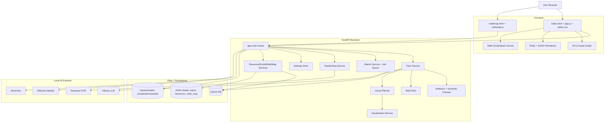

# Euclid's Window

Euclid's Window is a local-first math tutoring platform that combines:

- structured AI tutoring (plain English + axiomatic modes),
- dynamic visualizations and Manim animations,
- concept graph + curated resources,
- guided prompt collections,
- and a handwriting scratchpad with answer validation.

The app is designed for iterative, interactive learning from basic to advanced topics.

## What You Get

- **Local Tutor workflow**
  - Context-aware tutor with response modes (`plain`, `axiomatic`, `both`)
  - Learner-level adaptation (`kids`, `teen`, `college`, `adult`)
  - Follow-up prompts, key takeaways, quality checks, improvement hints
  - Web RAG enrichment (toggleable in settings) for long-tail topics

- **On-demand visuals**
  - Diagram rendering via deterministic planner + tutor fallback
  - Animation rendering via Manim (background jobs with progress)
  - Unified Render Jobs panel in UI

- **Math scratchpad**
  - Mouse/trackpad grid canvas
  - OCR handwriting-to-text conversion
  - Symbolic answer validation + RAG assist for weak confidence

- **Learning navigation**
  - Prompt Collections organized by category/topic
  - Concept Graph (D3 force graph) with node-to-learning-path handoff
  - Euclid references, resources catalog, and math map

- **Evaluation and ops**
  - Eval dashboard/history/compare
  - Health/readiness/metrics endpoints
  - Docker-first deployment path

## Tech Stack

- **Backend**: FastAPI, Pydantic v2, SQLAlchemy, SymPy
- **Frontend**: Vanilla JS/HTML/CSS, D3.js, Plotly, KaTeX
- **AI/Media**: Ollama (local LLM), Manim, Diffusers, MusicGen
- **OCR**: Tesseract + Pillow + pytesseract
- **Infra**: Docker, docker-compose

## Architecture Diagram



## Repository Layout

```text
EuclidsWindow/
├── backend/
│   ├── app/
│   │   ├── main.py                  # API routes + app wiring
│   │   ├── models.py                # Pydantic request/response models
│   │   ├── config.py                # Settings/env defaults
│   │   ├── settings_store.py        # Persistent UI/runtime setting overrides
│   │   ├── content.py               # Topic catalog matcher
│   │   ├── ai/
│   │   │   ├── service.py           # Tutor orchestration + diagram jobs
│   │   │   ├── coordinator.py       # Multi-agent coordination
│   │   │   ├── didactics.py         # Structured explanations + learning aids
│   │   │   ├── checker.py           # Symbolic checks
│   │   │   ├── visual_planner.py    # Deterministic diagram planning
│   │   │   ├── web_rag.py           # Lightweight web enrichment
│   │   │   └── handwriting.py       # Scratchpad OCR pipeline
│   │   ├── services/
│   │   │   ├── visualization.py
│   │   │   ├── manim_service.py
│   │   │   ├── mindmap.py
│   │   │   ├── mathmap.py
│   │   │   ├── euclid.py
│   │   │   ├── resource.py
│   │   │   └── conversation.py
│   │   ├── db/
│   │   └── manim_scenes/
│   ├── data/                        # seed + domain JSON data
│   ├── tests/                       # unit/integration tests
│   └── requirements*.txt
├── frontend/
│   ├── index.html                   # Main multi-tab app UI
│   ├── app.js                       # UI behavior + API integration
│   ├── styles.css
│   ├── mathmap.html                 # Dedicated map page
│   ├── mathmap.js
│   └── mathmap.css
├── docs/
│   └── OLLAMA_TUNING.md
├── scripts/
│   ├── start-local-tutor.sh
│   ├── start-all.sh
│   └── docker-entrypoint.sh
├── Dockerfile
├── docker-compose.yml
└── nginx.conf
```

## Quick Start

### Option A: Docker (recommended)

```bash
docker compose up -d --build
```

Open:

- `http://localhost:8000/` (main app)
- `http://localhost:8000/mathmap.html` (interactive map page)

If you want the local Ollama service in compose too:

```bash
docker compose --profile ollama up -d
```

### Option B: Local Python

```bash
python3.10 -m venv .venv
source .venv/bin/activate
pip install -r backend/requirements.txt
cd backend
uvicorn app.main:app --host 127.0.0.1 --port 8000 --reload
```

Open `http://127.0.0.1:8000/`.

## Configuration

Core settings come from `backend/app/config.py` (env-backed through `BaseSettings`), and can also be changed via UI Settings API.

Important keys:

- `LOCAL_AI_ENABLED`
- `LOCAL_LLM_PROVIDER` (`ollama` by default)
- `LOCAL_LLM_MODEL`
- `LOCAL_LLM_BASE_URL`
- `LOCAL_MULTI_AGENT_ENABLED`
- `LOCAL_WEB_RAG_ENABLED`
- `LOCAL_MEDIA_ENABLED`
- `LOCAL_DIFFUSION_MODEL`
- `LOCAL_MUSIC_MODEL`
- `LOCAL_MEDIA_DEVICE` (`cpu`/`cuda`/`mps`)
- `DATABASE_URL`
- `JWT_SECRET`

See:

- `docs/OLLAMA_TUNING.md` for quick Ollama tuning defaults
- `docs/LORA_TUNING_PLAYBOOK.md` for full LoRA/QLoRA training-to-serving workflow

## Local Model Tuning (LoRA / QLoRA)

You can tune a local math model for this app using LoRA adapters, then serve the tuned model through Ollama.

### What LoRA gives you here

- Better adherence to Euclid's Window response style (structured math explanations)
- Improved domain behavior on your custom prompt/eval set
- Lower compute cost versus full-model fine-tuning

### Practical workflow

1. **Pick a base model** (example: `qwen2.5-math:7b` family).
2. **Prepare training data** from your target interactions:
   - tutor QA pairs,
   - prompt-collection style step-by-step responses,
   - failure/regression examples from eval runs.
3. **Run QLoRA training** (typically with Hugging Face PEFT/TRL or Unsloth).
4. **Merge adapter into base model** (or keep adapter + base for runtime frameworks that support it).
5. **Export to GGUF** for Ollama serving (if your toolchain requires conversion).
6. **Create an Ollama model** and point app settings to it.

### Minimal serving step (after training/export)

Create `Modelfile`:

```text
FROM /absolute/path/to/your-tuned-model.gguf
PARAMETER temperature 0.2
PARAMETER top_p 0.9
PARAMETER num_ctx 8192
SYSTEM You are a math tutor for Euclid's Window. Be concise, accurate, and structured.
```

Build and test:

```bash
ollama create euclid-math-lora -f Modelfile
ollama run euclid-math-lora
```

Configure app to use tuned model:

```bash
export LOCAL_LLM_MODEL=euclid-math-lora
```

or set it in the UI under **Settings → Local LLM Model**.

### Evaluation loop (recommended)

- Run app eval endpoints (`/api/eval/report`, `/api/eval/history`, `/api/eval/compare`)
- Track improvements in:
  - checks pass rate,
  - visualization coverage,
  - latency/timeout behavior,
  - quality on follow-up flow prompts.

### Notes

- Ollama itself is primarily an inference/runtime layer; LoRA training is usually done in external training frameworks, then imported.
- Keep a baseline model (e.g., `euclid-math-base`) and tuned variants (e.g., `euclid-math-lora-v1`) for safe rollback.
- Respect base model license constraints when distributing tuned weights.

## Main User Flows

### 1) Tutor + progressive follow-ups

1. Ask a question in **Local Tutor**
2. Pick response mode + learner level
3. Use generated follow-up chips for progressive flow
4. Render diagram/animation on demand when needed

### 2) Scratchpad answer checking

1. Write on grid canvas (mouse/trackpad)
2. Convert handwriting to typed text
3. Edit OCR text if needed
4. Validate against current tutor question

### 3) Guided learning paths

1. Open **Prompt Collections**
2. Filter by category/query
3. Click a prompt to auto-run it in Tutor

### 4) Concept graph navigation

1. Open **Concept Graph**
2. Click a node for details
3. Open learning path to jump to Prompt Collections

## Product Flow With Screenshots

> Screenshots are stored in `docs/images/`.

### A) Ask + Understand + Follow-up

1. Ask a concept question in **Local Tutor**.
2. Use suggestion chips to deepen understanding step-by-step.
3. Review plain + axiomatic explanations and checks.


### B) Visualize + Scratchpad + Validate

1. Render a diagram/animation for the same topic.
2. Write work in the scratchpad grid.
3. Convert handwriting to text and validate answer.


## API Overview

### Platform

- `GET /health`
- `GET /ready`
- `GET /metrics`

### Auth & Profile

- `POST /api/auth/register`
- `POST /api/auth/login`
- `GET /api/auth/me`
- `PATCH /api/auth/me`

### Progress & Conversations

- `GET /api/progress`
- `PUT /api/progress/{concept_slug}`
- `POST /api/conversations`
- `GET /api/conversations`
- `GET /api/conversations/{conversation_id}`
- `POST /api/chat/message`

### Tutor / AI

- `POST /api/ai/tutor`
- `POST /api/ai/visualize`
- `POST /api/ai/media/image`
- `POST /api/ai/media/music`
- `POST /api/ai/handwriting/recognize`
- `POST /api/ai/handwriting/validate`

### Jobs / Visualization / Animation

- `GET /api/visualizations/jobs`
- `GET /api/visualizations/jobs/{job_id}`
- `DELETE /api/visualizations/jobs/{job_id}`
- `GET /api/visualizations/{viz_id}`
- `GET /api/animations/scenes`
- `GET /api/animations/jobs`
- `POST /api/animations/render`
- `GET /api/animations/{animation_id}`
- `DELETE /api/animations/{animation_id}`
- `GET /api/animations/status/manim`

### Learning Data

- `GET /api/mindmap/{concept_slug}`
- `GET /api/concepts`
- `GET /api/euclid/{reference}`
- `GET /api/euclid`
- `GET /api/prompt-collections`
- `GET /api/resources`
- `POST /api/resources/import/awesome-math`
- `GET /api/resources/{resource_id}`
- `GET /api/concepts/{concept_slug}/resources`
- `GET /api/mathmap`
- `GET /api/mathmap/categories`
- `GET /api/mathmap/category/{category_id}`
- `GET /api/mathmap/topic/{topic_id}`
- `GET /api/mathmap/search`

### Settings and Evaluation

- `GET /api/settings`
- `PUT /api/settings`
- `GET /api/settings/validate`
- `POST /api/settings/test`
- `GET /api/agents`
- `GET /api/eval/report`
- `GET /api/eval/history`
- `GET /api/eval/compare`
- `GET /api/eval/report/export`

Interactive API docs:

- `http://localhost:8000/docs`
- `http://localhost:8000/redoc`

## Testing

### Local

```bash
source .venv/bin/activate
pip install -r backend/requirements-dev.txt
pytest backend/tests -q
```

### Docker

```bash
docker compose run --rm euclids-window sh -lc "pip install -q -r /app/backend/requirements-dev.txt && pytest /app/backend/tests -q"
```

## LoRA Developer Shortcuts

Use the Makefile helpers:

```bash
cp backend/data/raw_tuning_records.sample.json backend/data/raw_tuning_records.json
make lora-prepare LORA_INPUT=backend/data/raw_tuning_records.json
make lora-train
make lora-eval API_BASE=http://localhost:8000
```

Optional (follow-up-focused dataset for conversational flow tuning):

```bash
cp backend/data/raw_tuning_records.followup.sample.json backend/data/raw_tuning_records.json
make lora-prepare LORA_INPUT=backend/data/raw_tuning_records.json
```

Weighted merge (example: 2x follow-up samples in one combined set):

```bash
make lora-prepare-merged LORA_FOLLOWUP_WEIGHT=2 LORA_OUTPUT=backend/data/lora_train.jsonl
```

Reproducible shuffling (fixed seed):

```bash
make lora-prepare-merged LORA_FOLLOWUP_WEIGHT=2 LORA_SHUFFLE_SEED=42 LORA_OUTPUT=backend/data/lora_train.jsonl
```

Disable shuffling entirely (deterministic concatenation order):

```bash
make lora-prepare-merged LORA_FOLLOWUP_WEIGHT=2 LORA_NO_SHUFFLE=1 LORA_OUTPUT=backend/data/lora_train.jsonl
```

## Troubleshooting

- **UI looks stale after changes**
  - Hard refresh: `Cmd+Shift+R`

- **Animation fails with LaTeX/MathTex errors**
  - Ensure Docker image includes TeX packages (already in `Dockerfile`)
  - Rebuild: `docker compose up -d --build`

- **Scratchpad OCR unavailable**
  - Ensure `tesseract-ocr` is installed in image
  - Ensure `Pillow` + `pytesseract` are installed

- **Tutor repeats topic response for follow-ups**
  - Recent fixes route follow-ups through dynamic tutor flow; update to latest and rebuild

- **No local model response**
  - Verify Ollama availability and model name
  - Check settings (`/api/settings`) and model tests (`/api/settings/test`)

## Notes

- This project prioritizes local-first learning and iterative pedagogical improvements.
- Prompt collections, concept graph, and render jobs are designed to support long learning sessions.
- `docs/OLLAMA_TUNING.md` contains model-specific tuning guidance for stricter output behavior.
