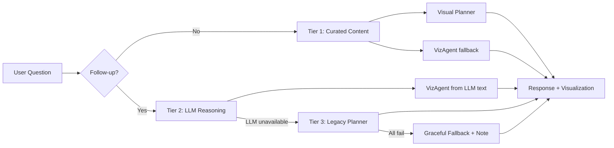
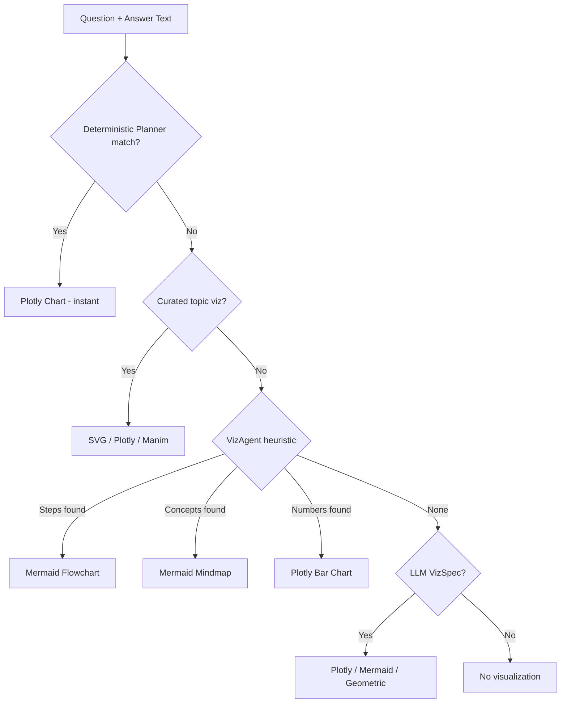

# Euclid's Window

**Learn math from first principles** — like Euclid's *Elements*: start from self-evident axioms, derive everything step by step.

Euclid's Window is a local-first math tutoring platform that combines structured AI tutoring, seven interactive labs (matrix algebra, calculus, music theory, signal processing, cryptology, formal logic, and FFT), dynamic 3Blue1Brown-style Manim animations, and a curated concept graph. Content is adapted to four learner levels (kids, teen, college, adult) with 130+ curated topics and 104 concept-graph nodes spanning arithmetic through orbital mechanics.

## What You Get

- **Generative Tutor (3-tier architecture)**
  - **Tier 1 — Curated content** (instant): 130+ hand-written topics with 4 learner-level variants, served on first question
  - **Tier 2 — LLM reasoning** (conversational): Follow-up questions and uncurated topics routed to a local LLM (Ollama) with level-aware prompts and curated context as grounding
  - **Tier 3 — Multi-agent / legacy planner**: JSON-plan LLM path with visualization code generation
  - Context-aware with response modes (`plain`, `axiomatic`, `both`)
  - Learner-level adaptation (`kids`, `teen`, `college`, `adult`) with audience-specific LLM instructions
  - Follow-up prompts, key takeaways, quality checks, improvement hints
  - Semantic conversation history via ChromaDB vector store
  - Web RAG enrichment (toggleable) for long-tail topics

- **VizAgent — AI-driven lightweight visualization**
  - Automatically generates visualizations from any tutor answer text
  - **Heuristic extraction** (instant, no LLM): step-by-step text → Mermaid flowchart; bold concepts → Mermaid mindmap; labeled numbers → Plotly bar chart
  - **LLM extraction** (optional): asks the LLM to output a structured JSON VizSpec → rendered as Plotly, Mermaid, or geometric SVG
  - 10+ deterministic Plotly visualizations: Euler's identity (unit circle), golden ratio (Fibonacci convergence), Pythagorean theorem, prime sieve, integral (area under curve), limit (sin(x)/x), Taylor series approximations, polar rose curves, Fourier transform (time vs frequency domain), derivatives (tangent line), and more
  - Standalone API (`/api/ai/viz-agent`) and "Auto-Visualize (AI)" button in the tutor panel
  - Mermaid.js support for flowcharts, mindmaps, timelines, and sequence diagrams

- **Model switching and hardware presets**
  - Default model: `qwen2.5:1.5b` (CPU-friendly, ~1.5B parameters)
  - UI-based model selector with hardware presets (CPU-light, CPU, GPU, Apple Silicon)
  - Recommended models list categorized by hardware tier
  - Pull new models from Ollama directly from the Settings UI
  - Smart model warm-up: checks if model is loaded in memory, triggers background loading, falls back to curated content for instant first response

- **Interactive Labs** (collapsed under a single "Labs" dropdown in the nav)
  - **Matrix / Vector Lab** — 2×2 and 3×3 matrix operations, by-hand practice with AI coach, coordinate-grid visualization of transformations with 3×3 homogeneous projection, two-column layout with sticky visualization panel, and **Manim animation generator** that renders 3Blue1Brown-style animations of any matrix transformation
  - **Music & Mathematics Lab** — five interactive games: Mozart's Musical Dice Game, Harmonic Series Explorer, Euclidean Rhythms (Bjorklund), Fibonacci Scales, Pythagorean Tuning
  - **Calculus Lab** — six interactive visualizations: Slope Explorer (tangent line & derivative), Area Under a Curve (Riemann sums with left/right/midpoint/trapezoid methods), Optimization Playground (fence/box/can problems), Differential Equations Simulator (exponential/logistic/predator-prey/SIR), Projectile Lab (position/velocity/acceleration), Orbital Mechanics (Hohmann transfer orbits to Moon/Mars with real physics)
  - **FFT Lab (Audio)** — record/load audio, forward FFT (Cooley-Tukey), 10-band frequency editor, inverse FFT, playback of original vs. modified signal
  - **FFT Lab (Image)** — load/upload image, 2D FFT (row-column decomposition), magnitude spectrum + phase display, frequency-domain filtering (low-pass / high-pass / band-pass / band-stop with adjustable radius), inverse 2D FFT with side-by-side comparison
  - **Cryptology Lab** — four games built on real math: Caesar Cipher with interactive SVG wheel (modular arithmetic), Frequency Analysis (statistics breaks codes), RSA Playground (public-key encryption with real number theory), Diffie-Hellman Key Exchange (discrete logarithms). Each game starts with a math prerequisite brief linking to relevant topics
  - **Formal Logic Lab** — four interactive puzzles: Truth Table Builder (propositional formula evaluator), Syllogism Validator (Aristotle's engine of reason with classic and fallacy examples), Knights & Knaves puzzles (proof by contradiction), Logic Gate Circuit Builder (wire AND/OR/NOT gates to build XOR, NAND, majority vote, half adder, multiplexer). Includes historical anecdotes from mathematics and social usage
  - Each lab step includes tabbed math explanations for all four learner levels

- **Mathematical Symbols Explorer**
  - Comprehensive reference of mathematical notation — Greek letters, arithmetic operators, set theory, logical symbols, calculus operators, algebraic symbols, relations, and geometry notation
  - History of each symbol's origin and first usage
  - Overlapping meanings across different branches of mathematics
  - Topic connections linking symbols to the math areas where they appear
  - Search and filter by category with detailed expansion cards
  - LaTeX rendering for all mathematical expressions

- **On-demand visuals & dynamic animation pipeline**
  - Instant Plotly charts via deterministic visual planner (keyword-matched)
  - VizAgent auto-generation from LLM answer text (Plotly, Mermaid, geometric SVG)
  - **Dynamic Manim animation pipeline**: heuristic template matching for 14+ math topics (derivatives, integrals, linear transforms, Taylor series, Fourier, complex numbers, etc.) with LLM-driven code generation fallback for novel topics, sandboxed rendering, and iterative error recovery
  - Matrix Lab animation generator — renders user-defined matrix transformations as Manim GIFs directly from the lab UI
  - Animation rendering via Manim (background jobs with progress polling)
  - Diffusion image generation (Stable Diffusion, optional GPU)
  - LaTeX equation editor with live preview, quick templates, insert/copy actions

- **Math scratchpad**
  - Mouse/trackpad grid canvas
  - OCR handwriting-to-text conversion
  - Symbolic answer validation + RAG assist for weak confidence

- **Learning navigation**
  - Prompt Collections organized by category/topic
  - Concept Graph (D3 force graph) with node-to-learning-path handoff
  - Euclid references, resources catalog, and interactive Math Map
  - Cross-navigation: "Explore in Tutor" links in labs route questions directly to the tutor

- **Evaluation and ops**
  - Eval dashboard / history / compare
  - Health / readiness / metrics endpoints
  - Docker-first deployment path

## Tech Stack

- **Backend**: FastAPI, Pydantic v2, SQLAlchemy, SymPy, ChromaDB (vector store)
- **Frontend**: Vanilla JS/HTML/CSS, D3.js, Plotly.js, Mermaid.js, KaTeX, Web Audio API
- **AI/Media**: Ollama (local LLM — default `qwen2.5:1.5b`), Manim, Diffusers (SDXL-Turbo), MusicGen
- **Visualization**: VizAgent (heuristic + LLM-driven), deterministic Plotly planner, Mermaid diagrams, Manim animations (dynamic pipeline with 14+ templates), SVG
- **Algorithms**: Cooley-Tukey FFT/IFFT (1D + 2D), Bjorklund's algorithm (Euclidean rhythms), Hohmann transfer orbits (orbital mechanics), RSA/Diffie-Hellman (number theory), propositional logic parser
- **OCR**: Tesseract + Pillow + pytesseract
- **Infra**: Docker, docker-compose

## Architecture Diagram


```mermaid
flowchart TB
    U[User Browser]

    subgraph FE[Frontend]
      UI[index.html + app.js + styles.css]
      MM[mathmap.html + mathmap.js]
      ML[musiclab.js]
      CL[calclab.js]
      FL[fftlab.js + fftlab-image.js]
      CRYPTO[cryptolab.js]
      LOGIC[logiclab.js]
      SYM[symbols.js]
      D3[D3 Concept Graph]
      PLT[Plotly + KaTeX Renderers]
      MER[Mermaid.js Diagrams]
      WA[Web Audio API]
      SP[Math Scratchpad Canvas]
    end

    subgraph BE[FastAPI Backend]
      API[app.main routes]
      TUTOR[Tutor Service - 3-tier]
      CONTENT[Content Catalog + Topic Matcher]
      DID[Didactics + Symbolic Checker]
      RAG[Web RAG]
      CTX[Context Window - ChromaDB]
      VIZ[Visualization Service]
      VP[Visual Planner - 20+ Plotly templates]
      VA[VizAgent - heuristic + LLM extraction]
      MANIM[Manim Service + Job Queue]
      APIPE[Animation Pipeline - templates + LLM codegen]
      OCR[Handwriting Service]
      STORE[Settings Store + Hardware Presets]
      RES[Resource/Euclid/MathMap Services]
    end

    subgraph DATA[Data + Persistence]
      SQLITE[(SQLite DB)]
      CHROMA[(ChromaDB Vector Store)]
      JSON[(JSON Seeds: 130+ topics, 104 concepts, resources)]
      STATIC[(backend/static visualizations/media)]
    end

    subgraph LOCALAI[Local AI Runtime]
      OLLAMA[Ollama LLM - qwen2.5:1.5b default]
      DIFF[Diffusion Models - SDXL-Turbo]
      MUSIC[MusicGen]
      TESS[Tesseract OCR]
    end

    U --> UI
    U --> MM
    UI --> API
    MM --> API
    UI --> D3
    UI --> PLT
    UI --> MER
    UI --> SP
    UI --> WA
    UI --> ML
    UI --> CL
    UI --> FL
    UI --> CRYPTO
    UI --> LOGIC
    UI --> SYM

    API --> TUTOR
    TUTOR --> CONTENT
    TUTOR --> DID
    TUTOR --> RAG
    TUTOR --> CTX
    TUTOR --> VP
    TUTOR --> VA
    VP --> VIZ
    VA --> VIZ
    API --> MANIM
    API --> APIPE
    APIPE --> MANIM
    APIPE --> OLLAMA
    API --> OCR
    API --> STORE
    API --> RES

    RES --> SQLITE
    TUTOR --> SQLITE
    CTX --> CHROMA
    API --> STATIC
    RES --> JSON

    TUTOR --> OLLAMA
    VA --> OLLAMA
    API --> DIFF
    API --> MUSIC
    OCR --> TESS
```

### Tutor Flow (3-Tier Architecture)


```mermaid
flowchart LR
    Q[User Question] --> FU{Follow-up?}
    FU -- No --> T1[Tier 1: Curated Content]
    FU -- Yes --> T2[Tier 2: LLM Reasoning]
    T1 --> VP[Visual Planner]
    T1 --> VA1[VizAgent fallback]
    T2 -- LLM unavailable --> T3[Tier 3: Legacy Planner]
    T2 --> VA2[VizAgent from LLM text]
    T3 -- All fail --> FB[Graceful Fallback + Note]
    VP --> R[Response + Visualization]
    VA1 --> R
    VA2 --> R
    T3 --> R
    FB --> R
```

### Visualization Pipeline


```mermaid
flowchart TD
    Q[Question + Answer Text] --> P{Deterministic Planner match?}
    P -- Yes --> PLT[Plotly Chart - instant]
    P -- No --> C{Curated topic viz?}
    C -- Yes --> CV[SVG / Plotly / Manim]
    C -- No --> VA{VizAgent heuristic}
    VA -- Steps found --> MF[Mermaid Flowchart]
    VA -- Concepts found --> MM[Mermaid Mindmap]
    VA -- Numbers found --> BC[Plotly Bar Chart]
    VA -- None --> LLM{LLM VizSpec?}
    LLM -- Yes --> SPEC[Plotly / Mermaid / Geometric]
    LLM -- No --> NONE[No visualization]
```

## Repository Layout

```text
EuclidsWindow/
├── backend/
│   ├── app/
│   │   ├── main.py                  # API routes + app wiring
│   │   ├── models.py                # Pydantic request/response models
│   │   ├── config.py                # Settings/env defaults
│   │   ├── settings_store.py        # Persistent UI/runtime setting overrides
│   │   ├── content.py               # Topic catalog + keyword scoring matcher
│   │   ├── ai/
│   │   │   ├── service.py           # Tutor orchestration + diagram jobs
│   │   │   ├── engine.py            # Ollama LLM wrapper (HTTP + CLI, warm-up, model status)
│   │   │   ├── viz_agent.py         # VizAgent: heuristic + LLM viz extraction
│   │   │   ├── visual_planner.py    # Deterministic Plotly planner (20+ templates)
│   │   │   ├── executor.py          # Plotly/Manim code sandbox execution
│   │   │   ├── animation_pipeline.py # Dynamic Manim pipeline (template + LLM + retry)
│   │   │   ├── manim_templates.py   # 14+ reusable Manim scene templates
│   │   │   ├── prompts.py           # LLM prompts + level-aware instructions
│   │   │   ├── coordinator.py       # Multi-agent coordination
│   │   │   ├── didactics.py         # Structured explanations + learning aids
│   │   │   ├── checker.py           # Symbolic checks
│   │   │   ├── media.py             # Diffusion image + MusicGen services
│   │   │   ├── web_rag.py           # Lightweight web enrichment
│   │   │   └── handwriting.py       # Scratchpad OCR pipeline
│   │   ├── services/
│   │   │   ├── visualization.py
│   │   │   ├── manim_service.py
│   │   │   ├── mindmap.py
│   │   │   ├── mathmap.py
│   │   │   ├── euclid.py
│   │   │   ├── resource.py
│   │   │   └── conversation.py      # Semantic context window (ChromaDB)
│   │   ├── db/
│   │   └── manim_scenes/
│   ├── data/
│   │   ├── demo_topics.json         # 130+ topics with 4 learner-level variants
│   │   ├── math_map.json            # Categories + topic prompts for Math Map
│   │   ├── seed_concepts.json       # Concept graph nodes + prerequisites
│   │   ├── seed_euclid.json         # Euclid's Elements references
│   │   └── seed_resources.json      # Curated resource catalog
│   ├── scripts/
│   │   └── seed_db.py               # Database seeding utility
│   ├── tests/
│   └── requirements*.txt
├── frontend/
│   ├── index.html                   # Main multi-tab app UI
│   ├── app.js                       # UI behavior, tab navigation, API integration
│   ├── styles.css                   # Monochrome scholarly theme
│   ├── musiclab.js                  # Music & Mathematics Lab (5 games)
│   ├── calclab.js                   # Calculus Lab (6 interactive visualizations)
│   ├── fftlab.js                    # FFT Lab: audio mode + mode switcher
│   ├── fftlab-image.js              # FFT Lab: image mode (2D FFT)
│   ├── cryptolab.js                 # Cryptology Lab (4 crypto games)
│   ├── logiclab.js                  # Formal Logic Lab (4 logic puzzles)
│   ├── symbols.js                   # Mathematical Symbols Explorer
│   ├── mathmap.html                 # Dedicated map page
│   ├── mathmap.js
│   ├── mathmap.css
│   └── euclids-window-logo.png      # B&W logo
├── docs/
│   ├── OLLAMA_TUNING.md
│   └── LORA_TUNING_PLAYBOOK.md
├── scripts/
│   ├── start-local-tutor.sh
│   ├── start-all.sh
│   └── docker-entrypoint.sh
├── start.sh                         # 🚀 One-command Docker startup
├── restart.sh                       # Quick container restart
├── stop.sh                          # Stop all containers
├── docker-commands.sh               # Docker command reference
├── DOCKER.md                        # Complete Docker documentation
├── Makefile                         # LoRA shortcuts
├── Dockerfile
├── docker-compose.yml
└── nginx.conf
```

## Topic Coverage

Content in `demo_topics.json` spans 130+ curated topics across 15 categories. The concept graph (`seed_concepts.json`) contains 104 nodes with prerequisite chains. Each topic has 4-level (kids/teen/college/adult) explanations:

| Category | Example Topics |
|---|---|
| **Foundations** | Addition, Division, Fractions, Primes, Modular Arithmetic, Natural Numbers, Integers |
| **Algebra** | Quadratic Equations, Logarithms, Matrices, Polynomials, Systems of Equations |
| **Geometry** | Pythagorean Theorem, Coordinate Geometry, Circles, Triangles, Transformations, Polygons |
| **Calculus** | Limits, Derivatives, Integrals, Taylor Series, Riemann Sums, Optimization, Differential Equations, Projectile Motion, Orbital Mechanics (Hohmann transfers) |
| **Discrete Math** | Graph Theory, Combinatorics, Probability, Cryptography, Game Theory |
| **Cryptology** | Caesar Cipher (modular arithmetic), Frequency Analysis, RSA Encryption (prime factorization, Euler's totient), Diffie-Hellman Key Exchange (discrete logarithms) |
| **Formal Logic** | Propositional Logic (truth tables), Categorical Logic (syllogisms), Proof by Contradiction (Knights & Knaves), Boolean Algebra & Circuit Design (logic gates) |
| **Linear Algebra** | Vectors, Eigenvalues, Singular Value Decomposition, Linear Transformations |
| **Number Theory** | Primes, Fermat's Last Theorem, Rational/Real Numbers, Topology |
| **Music & Mathematics** | Harmonic Series, Pythagorean Tuning, Euclidean Rhythms, Mozart's Dice Game, Fibonacci Scales, Fractal Music, Group Theory in Music, Wave Equation of Sound |
| **Signal Processing & FFT** | FFT Algorithm, Inverse FFT, Frequency Filtering, 2D Image FFT, Fourier Image Compression |
| **AI & Neural Networks** | Neural Network Math, Backpropagation, Attention, Transformers, LoRA, RAG, Loss Functions, Dimensionality Reduction |
| **Recreational Math** | Conway's Game of Life, Surreal Numbers, Look-and-Say Sequence, Puzzles (Logic, Matchstick, River Crossing, Chess) |
| **Math in Literature** | Alice's Logic Paradoxes, Red Queen's Race, Jabberwocky Sets, Math in Poetry |
| **Famous Mathematicians** | Euler, Ramanujan, Emmy Noether, Fermat |
| **Chaos & Fractals** | Chaos Theory, Fractals, Differential Equations |
| **Mathematical Logic** | Axioms, Proofs, Set Theory, Mathematical Logic |

## Quick Start

### Option A: Docker (recommended) - One-Command Setup

The easiest way to get started:

```bash
./start.sh
```

This script will:
- ✅ Check Docker is running
- ✅ Build the containers from scratch
- ✅ Start all services (app + Ollama)
- ✅ Wait for everything to be ready
- ✅ Show you the URL when ready

Open `http://localhost:8000/` when the script completes.

**Other helpful scripts:**

```bash
./restart.sh        # Quick restart (no rebuild)
./stop.sh          # Stop all containers
./docker-commands.sh   # Show all available commands
```

See [`DOCKER.md`](DOCKER.md) for complete Docker setup documentation.

### Option A (Manual): Docker with docker-compose

```bash
docker compose up -d --build
```

Seed the database (first run, or after adding new topics):

```bash
docker compose exec euclids-window python scripts/seed_db.py
```

Open:

- `http://localhost:8000/` (main app)
- `http://localhost:8000/mathmap.html` (interactive map page)

**Useful commands:**

```bash
docker compose logs -f           # View logs
docker compose down              # Stop containers
docker compose ps                # Check status
docker compose down -v           # Clean everything including volumes
```

### Option B: Local Python

```bash
python3.10 -m venv .venv
source .venv/bin/activate
pip install -r backend/requirements.txt
cd backend
uvicorn app.main:app --host 127.0.0.1 --port 8000 --reload
```

Open `http://127.0.0.1:8000/`.

## Configuration

Core settings come from `backend/app/config.py` (env-backed through `BaseSettings`), and can also be changed via the **Settings** tab in the UI or the Settings API.

### Docker Environment Variables

You can customize the Docker setup by creating a `.env` file in the project root:

```bash
# .env
HOST_PORT=8080                    # Change port (default: 8000)
LOCAL_LLM_MODEL=qwen2.5:7b       # Use a different model
LOCAL_LLM_BASE_URL=http://host.docker.internal:11434  # External Ollama
```

The `./start.sh` script respects these environment variables automatically.

### LLM Model Configuration

| Setting | Default | Description |
|---|---|---|
| `LOCAL_LLM_PROVIDER` | `ollama` | LLM provider |
| `LOCAL_LLM_MODEL` | `qwen2.5:1.5b` | Default model (CPU-friendly) |
| `LOCAL_LLM_BASE_URL` | `http://ollama:11434` | Ollama API endpoint |
| `LOCAL_LLM_TIMEOUT_SECONDS` | `120` | Generation timeout |

**Hardware presets** (configurable in Settings UI):

| Preset | Model | Device | Best For |
|---|---|---|---|
| CPU-light | `qwen2.5:0.5b` | cpu | Low-end machines, Raspberry Pi |
| CPU | `qwen2.5:1.5b` | cpu | Standard laptops, Docker on Mac/Linux |
| GPU | `llama3.1:8b` | cuda | NVIDIA GPU with 8+ GB VRAM |
| Apple Silicon | `llama3.1:8b` | mps | M1/M2/M3 Macs |

The model can be switched at runtime from the Settings tab without restarting the app. New models can be pulled from Ollama directly from the UI.

### Other Important Keys

- `LOCAL_AI_ENABLED` — enable/disable the AI tutor pipeline
- `LOCAL_MULTI_AGENT_ENABLED` — enable multi-agent coordinator (Tier 3)
- `LOCAL_WEB_RAG_ENABLED` — web enrichment for long-tail topics
- `LOCAL_MEDIA_ENABLED` — diffusion image + music generation
- `LOCAL_DIFFUSION_MODEL` — default `stabilityai/sdxl-turbo`
- `LOCAL_MUSIC_MODEL` — MusicGen model ID
- `LOCAL_MEDIA_DEVICE` — `cpu`/`cuda`/`mps`
- `DATABASE_URL` — SQLite connection string
- `JWT_SECRET` — auth token signing key

See:

- `docs/OLLAMA_TUNING.md` for quick Ollama tuning defaults
- `docs/LORA_TUNING_PLAYBOOK.md` for full LoRA/QLoRA training-to-serving workflow

## Local Model Tuning (LoRA / QLoRA)

You can tune a local math model for this app using LoRA adapters, then serve the tuned model through Ollama.

### What LoRA gives you here

- Better adherence to Euclid's Window response style (structured math explanations)
- Improved domain behavior on your custom prompt/eval set
- Lower compute cost versus full-model fine-tuning

### Practical workflow

1. **Pick a base model** (example: `qwen2.5-math:7b` family).
2. **Prepare training data** from your target interactions:
   - tutor QA pairs,
   - prompt-collection style step-by-step responses,
   - failure/regression examples from eval runs.
3. **Run QLoRA training** (typically with Hugging Face PEFT/TRL or Unsloth).
4. **Merge adapter into base model** (or keep adapter + base for runtime frameworks that support it).
5. **Export to GGUF** for Ollama serving (if your toolchain requires conversion).
6. **Create an Ollama model** and point app settings to it.

### Minimal serving step (after training/export)

Create `Modelfile`:

```text
FROM /absolute/path/to/your-tuned-model.gguf
PARAMETER temperature 0.2
PARAMETER top_p 0.9
PARAMETER num_ctx 8192
SYSTEM You are a math tutor for Euclid's Window. Be concise, accurate, and structured.
```

Build and test:

```bash
ollama create euclid-math-lora -f Modelfile
ollama run euclid-math-lora
```

Configure app to use tuned model:

```bash
export LOCAL_LLM_MODEL=euclid-math-lora
```

or set it in the UI under **Settings → Local LLM Model**.

### Evaluation loop (recommended)

- Run app eval endpoints (`/api/eval/report`, `/api/eval/history`, `/api/eval/compare`)
- Track improvements in:
  - checks pass rate,
  - visualization coverage,
  - latency/timeout behavior,
  - quality on follow-up flow prompts.

### Notes

- Ollama itself is primarily an inference/runtime layer; LoRA training is usually done in external training frameworks, then imported.
- Keep a baseline model (e.g., `euclid-math-base`) and tuned variants (e.g., `euclid-math-lora-v1`) for safe rollback.
- Respect base model license constraints when distributing tuned weights.

## Main User Flows

### 1) Tutor + progressive follow-ups

1. Ask a question in **Tutor** (e.g., "Explain modular arithmetic")
2. Pick response mode + learner level — content adapts accordingly
3. First response uses rich curated content (instant); follow-up chips route to the LLM for genuine conversational responses (step-by-step, simpler, examples)
4. Visualizations auto-generated: Plotly charts from the visual planner, Mermaid diagrams from the VizAgent, or on-demand rendering
5. Click "Auto-Visualize (AI)" for a VizAgent-generated chart/diagram from any answer
6. Conversation context persists via semantic vector store

### 2) Interactive Labs

1. Open the **Labs** dropdown in the navigation bar
2. **Matrix Lab**: Enter matrices, perform operations, check by hand with AI coach, visualize transformations on a coordinate grid, generate Manim animations of matrix transformations
3. **Music Lab**: Play Mozart's Dice Game, explore harmonics, generate Euclidean rhythms, compare Pythagorean vs. equal-tempered tuning
4. **Calculus Lab**: Explore derivatives with the Slope Explorer, approximate integrals with Riemann sums, solve optimization problems interactively, simulate differential equations (exponential/logistic/predator-prey/SIR), launch projectiles, navigate Hohmann transfer orbits to the Moon or Mars
5. **FFT Lab (Audio)**: Record voice or load a sample tone → Run FFT → Edit frequency bands with sliders → Reconstruct with IFFT → Play original vs. modified
6. **FFT Lab (Image)**: Upload an image or load a sample → Run 2D FFT → View magnitude spectrum + phase → Apply low-pass/high-pass/band-pass/band-stop filters → Reconstruct with inverse 2D FFT → Compare original vs. filtered
7. **Crypto Lab**: Encrypt with the Caesar Cipher (interactive alphabet wheel), crack codes with frequency analysis, build RSA keys from primes, watch Diffie-Hellman key exchange unfold — each game starts with a math prerequisite brief
8. **Logic Lab**: Build truth tables from propositional formulas, validate syllogisms (spot the fallacy!), solve Knights & Knaves puzzles, wire logic gate circuits to build XOR, NAND, and half adders
9. Each step has inline math explanations for Kids, Teen, College, and Adult levels

### 3) Scratchpad answer checking

1. Write on grid canvas (mouse/trackpad)
2. Convert handwriting to typed text
3. Edit OCR text if needed
4. Validate against current tutor question

### 4) Guided learning paths

1. Open **Prompts** (Prompt Collections)
2. Filter by category/query
3. Click a prompt to auto-run it in Tutor

### 5) Concept graph navigation

1. Open **Concepts** (Concept Graph)
2. Click a node for details + prerequisites
3. Open learning path to jump to Prompt Collections

### 6) Math Map exploration

1. Open **Math Map** (dedicated page)
2. Browse categories: Foundations, Algebra, Geometry, Calculus, Music & Math, Signal Processing, etc.
3. Click any topic prompt to jump to the Tutor

### 7) Mathematical Symbols reference

1. Open **Symbols** in the navigation bar
2. Browse by category (Greek Letters, Arithmetic, Set Theory, Logic, Calculus, Algebra, Relations, Geometry)
3. Search for any symbol by name or glyph
4. Click a symbol card to see its history, overlapping meanings, and connected math topics

## Product Flow With Screenshots

> Screenshots are stored in `docs/images/`.

### A) Ask + Understand + Follow-up

1. Ask a concept question in **Tutor**.
2. Use suggestion chips to deepen understanding step-by-step.
3. Review plain + axiomatic explanations and checks.


### B) Visualize + Scratchpad + Validate

1. Render a diagram/animation for the same topic.
2. Write work in the scratchpad grid.
3. Convert handwriting to text and validate answer.


## API Overview

### Platform

- `GET /health`
- `GET /ready`
- `GET /metrics`

### Auth & Profile

- `POST /api/auth/register`
- `POST /api/auth/login`
- `GET /api/auth/me`
- `PATCH /api/auth/me`

### Progress & Conversations

- `GET /api/progress`
- `PUT /api/progress/{concept_slug}`
- `POST /api/conversations`
- `GET /api/conversations`
- `GET /api/conversations/{conversation_id}`
- `POST /api/chat/message`

### Tutor / AI

- `POST /api/ai/tutor` — 3-tier tutor (curated → LLM reasoning → legacy planner)
- `POST /api/ai/viz-agent` — generate visualization from question + answer text
- `POST /api/ai/visualize` — on-demand diagram/animation rendering
- `POST /api/ai/animate` — dynamic Manim animation via template + LLM pipeline
- `GET /api/ai/animate/templates` — list available template-based animation topics
- `POST /api/ai/media/image` — diffusion image generation
- `POST /api/ai/media/music` — music generation
- `POST /api/ai/handwriting/recognize`
- `POST /api/ai/handwriting/validate`

### Matrix Lab Animation

- `POST /api/matrix/animate` — render a Manim linear-transformation animation for a user-defined 2×2 matrix

### Jobs / Visualization / Animation

- `GET /api/visualizations/jobs`
- `GET /api/visualizations/jobs/{job_id}`
- `DELETE /api/visualizations/jobs/{job_id}`
- `GET /api/visualizations/{viz_id}`
- `GET /api/animations/scenes`
- `GET /api/animations/jobs`
- `POST /api/animations/render`
- `GET /api/animations/{animation_id}`
- `DELETE /api/animations/{animation_id}`
- `GET /api/animations/status/manim`

### Context Window

- `POST /api/context/store`
- `POST /api/context/retrieve`
- `DELETE /api/context/session/{session_id}`

### Learning Data

- `GET /api/mindmap/{concept_slug}`
- `GET /api/concepts`
- `GET /api/euclid/{reference}`
- `GET /api/euclid`
- `GET /api/prompt-collections`
- `GET /api/resources`
- `POST /api/resources/import/awesome-math`
- `GET /api/resources/{resource_id}`
- `GET /api/concepts/{concept_slug}/resources`
- `GET /api/mathmap`
- `GET /api/mathmap/categories`
- `GET /api/mathmap/category/{category_id}`
- `GET /api/mathmap/topic/{topic_id}`
- `GET /api/mathmap/search`

### Settings, Models, and Evaluation

- `GET /api/settings`
- `PUT /api/settings`
- `GET /api/settings/validate`
- `POST /api/settings/test`
- `GET /api/settings/models` — list installed + recommended Ollama models
- `POST /api/settings/models/pull` — download a new model from Ollama
- `GET /api/agents`
- `GET /api/eval/report`
- `GET /api/eval/history`
- `GET /api/eval/compare`
- `GET /api/eval/report/export`

Interactive API docs:

- `http://localhost:8000/docs`
- `http://localhost:8000/redoc`

## Testing

### Local

```bash
source .venv/bin/activate
pip install -r backend/requirements-dev.txt
pytest backend/tests -q
```

### Docker

```bash
docker compose run --rm euclids-window sh -lc "pip install -q -r /app/backend/requirements-dev.txt && pytest /app/backend/tests -q"
```

## LoRA Developer Shortcuts

Use the Makefile helpers:

```bash
cp backend/data/raw_tuning_records.sample.json backend/data/raw_tuning_records.json
make lora-prepare LORA_INPUT=backend/data/raw_tuning_records.json
make lora-train
make lora-eval API_BASE=http://localhost:8000
```

Optional (follow-up-focused dataset for conversational flow tuning):

```bash
cp backend/data/raw_tuning_records.followup.sample.json backend/data/raw_tuning_records.json
make lora-prepare LORA_INPUT=backend/data/raw_tuning_records.json
```

Weighted merge (example: 2x follow-up samples in one combined set):

```bash
make lora-prepare-merged LORA_FOLLOWUP_WEIGHT=2 LORA_OUTPUT=backend/data/lora_train.jsonl
```

Reproducible shuffling (fixed seed):

```bash
make lora-prepare-merged LORA_FOLLOWUP_WEIGHT=2 LORA_SHUFFLE_SEED=42 LORA_OUTPUT=backend/data/lora_train.jsonl
```

Disable shuffling entirely (deterministic concatenation order):

```bash
make lora-prepare-merged LORA_FOLLOWUP_WEIGHT=2 LORA_NO_SHUFFLE=1 LORA_OUTPUT=backend/data/lora_train.jsonl
```

## Troubleshooting

- **Docker startup issues**
  - Use `./start.sh` for automatic health checks and diagnostics
  - Check logs: `docker compose logs -f`
  - Clean restart: `docker compose down -v && ./start.sh`

- **UI looks stale after changes**
  - Hard refresh: `Cmd+Shift+R`
  - Quick restart: `./restart.sh`

- **Animation fails with LaTeX/MathTex errors**
  - Ensure Docker image includes TeX packages (already in `Dockerfile`)
  - Rebuild: `./start.sh` or `docker compose up -d --build`

- **Scratchpad OCR unavailable**
  - Ensure `tesseract-ocr` is installed in image
  - Ensure `Pillow` + `pytesseract` are installed

- **Tutor repeats topic response for follow-ups**
  - Recent fixes route follow-ups through dynamic tutor flow; update to latest and rebuild

- **No local model response**
  - Verify Ollama availability and model name
  - Check settings (`/api/settings`) and model tests (`/api/settings/test`)

- **FFT Lab microphone not working**
  - Browser requires HTTPS or localhost for microphone access
  - Grant microphone permission when prompted

- **2D Image FFT is slow**
  - 256×256 images require 512 FFTs of size 256 — computation runs in a `setTimeout` to avoid freezing the UI
  - Larger images are automatically resized to 256×256

## Design Philosophy

- **First principles**: Every concept is built up from axioms, not handed as rote formulas
- **Four-level content**: Kids get analogies and games; teens get real-world connections; college gets proofs and theorems; adults get industry applications and worked examples
- **Local-first**: All core functionality works offline with a local LLM; no cloud dependency required
- **Curated + generative hybrid**: Hand-written expert content for known topics (instant, high-quality), LLM for follow-ups and open-ended questions (conversational, adaptive)
- **Visualization everywhere**: Every answer gets a visualization — deterministic Plotly charts for math topics, Mermaid diagrams for concepts and proofs, VizAgent auto-generation for everything else
- **Lab-driven learning**: Interactive labs let you *do* the math, not just read about it — launch Hohmann transfer orbits, encrypt messages with RSA, solve Knights & Knaves puzzles, wire logic gates, record audio and see its frequency spectrum, upload an image and blur it with a low-pass filter, play Mozart's dice game, and generate 3Blue1Brown-style animations of matrix transformations
- **Hardware-aware**: Runs on anything from a Raspberry Pi (`qwen2.5:0.5b`) to an NVIDIA GPU (`llama3.1:8b`), with presets for each hardware tier
- **Classical scholarly aesthetic**: Cinzel Decorative typeface for the app name evoking Greek inscription lettering, with a monochrome palette of black, white, and warm grays — the content speaks for itself

## Notes

- This project prioritizes local-first learning and iterative pedagogical improvements.
- Prompt collections, concept graph, and render jobs are designed to support long learning sessions.
- `docs/OLLAMA_TUNING.md` contains model-specific tuning guidance for stricter output behavior.
- `docs/LORA_TUNING_PLAYBOOK.md` contains the full LoRA/QLoRA training-to-serving workflow.
